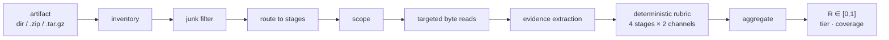

# ReproReady

[](https://github.com/adbX/reproready/actions/workflows/ci.yml)
[](LICENSE)
[](pyproject.toml)
<!-- [](https://pypi.org/project/reproready/) -->

**A static reproduction-readiness score for a code artifact: how well it equips
an independent researcher to regenerate the reported results — judged without
running any code.**

ReproReady measures **readiness, not executability**. It does not predict
whether the code would ultimately run; it measures whether the artifact removes
the manual effort a reproduction would otherwise cost. Point it at a directory,
a `.zip`, or a `.tar.gz` and it returns a score `R ∈ [0, 1]`, a tier, and a
graded grid you can inspect cell by cell.

## What it measures

Reproduction is modelled as four stages a researcher moves through, each judged
on two independent channels — the **implementation** (machine-actionable files)
and the **documentation** (human-readable prose that names and explains them):

| Stage | Question the artifact must answer |
|---|---|
| **E** — Environment | What does the code need to run? (pins, lockfiles, container) |
| **I** — Data / Inputs | Where does the data come from and how is it prepared? |
| **X** — Execution | How is the reported result actually produced? (entry points, configs) |
| **V** — Validation | How do the outputs map back to the paper's claims? |



The score is **non-compensatory**: a stage the artifact leaves unanswered
cannot be bought back by another stage. A single stage graded 0 pulls `R` to 0.
That bimodality is faithful — it is the signal that some part of the
reproduction path is missing.

## Quickstart

Requires Python 3.10+. Using [uv](https://docs.astral.sh/uv/):

```sh
uv add reproready            # or: pip install reproready
```

Score an artifact from the command line:

```sh
reproready score path/to/artifact.zip
reproready score my-project/ --json
```

Or from Python:

```python
from reproready import score_path

report = score_path("path/to/artifact.zip")
print(report.r, report.tier, report.coverage)
for cell, grade in report.grid.items():
    print(cell, grade.grade, grade.detector_id)
```

## Example output

Scoring the bundled `examples/demo-artifact`:

```
╭───────────────────────────── ReproReady ──────────────────────────────╮
│ examples/demo-artifact  kind=dir  has_code=True                        │
│ scope E/I/X/V = 1/1/1/1  runnable=5  readme=README.md                  │
│ R=0.93  tier=3  coverage=4/4                                           │
│ stage R  E=1.00  I=1.00  X=1.00  V=0.75                                │
╰────────────────────────────────────────────────────────────────────────╯
```

`V/implementation` sits at its deterministic floor (`0.5`): a result producer
is present, but a static read cannot confirm it reconstructs the reported
numbers. That is exactly the cell `--validate` can promote.

## Optional: the Validation call

`V/implementation` — whether the code actually reconstructs the reported
numbers — is the one judgment a static screen can only floor, not confirm.
`--validate` runs a single promote-only model call that can lift that one cell
from its deterministic floor; it never lowers any grade. It needs the `llm`
extra and an API key:

```sh
uv add 'reproready[llm]'
export ANTHROPIC_API_KEY=...
reproready score my-project/ --validate
```

## How it's built

The scoring core — `inventory`, `routing`, `scope`, `content`, `extract`,
`rubric`, `aggregate` — is **100% standard library**. `rich` is used only by
the CLI renderer, and `anthropic` only by the optional Validation call.

Full details: the [specification](docs/spec.md) (the model, grading, tiers, and
worked examples) and the [implementation reference](docs/implementation.md).

## License

MIT — see [LICENSE](LICENSE).
